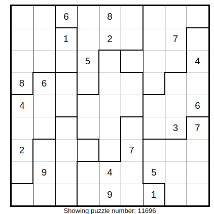

# KRsudoku
Sudoku SAT project for Knowledge Representation
Comparison of stochastic and deterministic SAT solvers in the domain of Regular vs. Irregular Sudoku Puzzles

**generate_solve.py** is where the most functions are implemented. With this module, it is possible to scrape sudoku puzzles from the website http://www.menneske.no/sudoku/eng/. Both, regular and irregular puzzles are scraped and converted into CNF formats. Irregular boundaries are also obtained through here. Pycosat solver is run within this module.

**main.py** makes shell calls to obtain the printed-out results from each solver. After storing the outputs on disk, this module parses each file according to their format. At the end, certain statistical analyses are applied here along with obtaining histogram plots, means, standard deviations, the results of normality tests, variance tests and t-tests.

In the **outputs** folder, you can find example outputs from different solvers applied to 2 different types of sudoku puzzles. (Some of them are shortened, as the upload limit was 25 MB).

**sudoku_regular** includes examples of regular, classic sudoku puzzles, saved as numpy arrays. Inside, dimacs folder contains the DIMACS representations of these puzzles, after removing some clues to achieve difficulty and preprocessing the literals (Converting 111 to 1 and so on).

**sudoku_irregular** includes examples of irregular, jigsaw sudoku puzzles, saved as numpy arrays. Inside, dimacs folder contains the DIMACS representations of these puzzles, after removing some clues to achieve difficulty and preprocessing the literals (Converting 111 to 1 and so on).

**regions_irregular** contains the regional information regarding each irregular sudoku puzzle. The areas of blocks are obtained through a search algorithm.

**rep_dict.txt** contains the dictionary to convert literals into solver-friendly formats. For instance, 111 is converted into 1. Otherwise, some solvers (particularly stochastic ones) might assign truth values to non-existent literals up to 111.

**Solvers utilized:**

* *pycosat: 0.6.2*
* *zchaff: 2007.3.12*
* *ubcsat: version 1.1.0 (Sea to Sky Release)*
* *walksat: v51*

The executables of the last three solvers are to be put inside "dimacs" folders. The first one is installed through pip.

  

